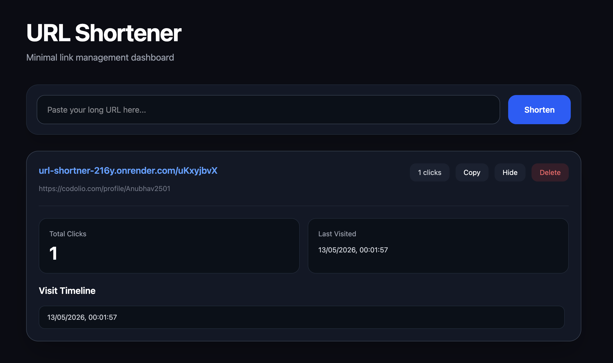

# URL Shortener

A full-stack URL Shortener application built using React, Node.js, Express, and MongoDB.

The application allows users to generate short URLs, track analytics, copy links instantly, and manage URLs through a responsive dashboard interface.

## Live Demo

Frontend:  
https://urlsht-job9.onrender.com

Backend:  
https://url-shortner-216y.onrender.com

---

## Features

- URL shortening
- Analytics tracking
- Click history
- Copy short URL
- Delete URLs
- Responsive UI
- MongoDB integration
- REST API architecture

---

## Tech Stack

### Frontend
- React
- Vite
- Tailwind CSS

### Backend
- Node.js
- Express.js
- MongoDB
- Mongoose

---

## Preview



---

## Installation

### Clone Repository

```bash
git clone https://github.com/anubhav1450/URL-shortner.git
cd URL-shortner
```

### Backend Setup

```bash
cd Backend
npm install
node server.js
```

### Frontend Setup

```bash
cd frontend
npm install
npm run dev
```

---

## Environment Variables

### Frontend `.env`

```env
VITE_API_URL=http://localhost:3000
```

### Backend `.env`

```env
MONGO_URI=your_mongodb_connection_string
PORT=3000
```
